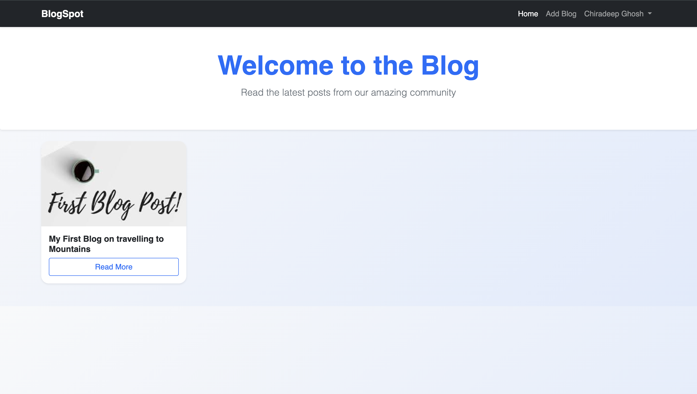
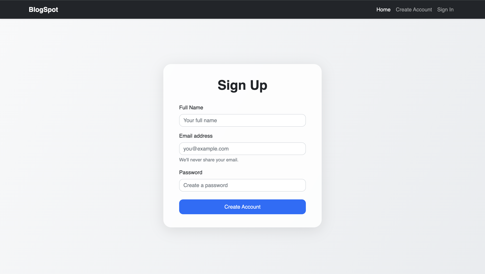
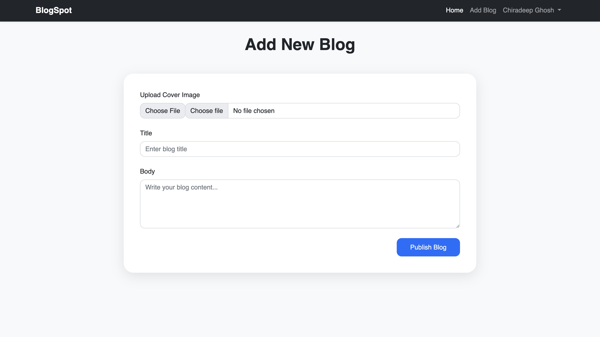
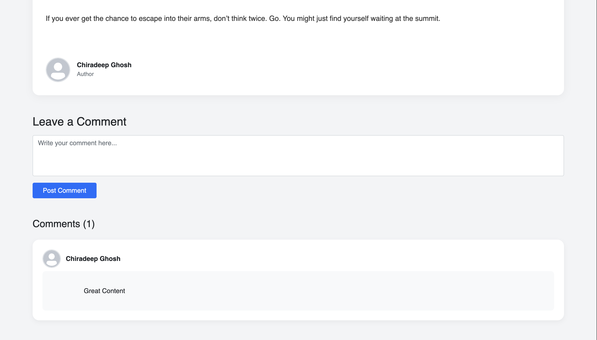

## Screenshots

### Home Page



### Sign Up Page



### Add New Blog Page



### Blog Details


### Blog Details




# BlogSpot - Blogging Platform

A simple, modern blogging platform built with Node.js, Express, EJS, and Bootstrap. Create, read, and comment on blogs with an attractive, responsive UI.

---

## Features

- User Authentication (Sign Up, Sign In)
- Create, edit, and delete blogs
- Upload cover images for blogs
- View blog details with comments
- Add comments on blogs
- Responsive design with Bootstrap
- Enhanced UI with animations and smooth effects

---

## Tech Stack

- Node.js
- Express.js
- EJS templating engine
- Bootstrap 5
- MongoDB (assumed for data storage)
- Multer (for image uploads)

---

## Prerequisites

- Node.js (v14 or above)
- npm (comes with Node.js)
- MongoDB database (local or cloud)

---

## Getting Started

1. **Clone the repository:**

   ```bash
   git clone https://github.com/chiradeep98/Blog-Spot.git
   cd Blog-Spot

